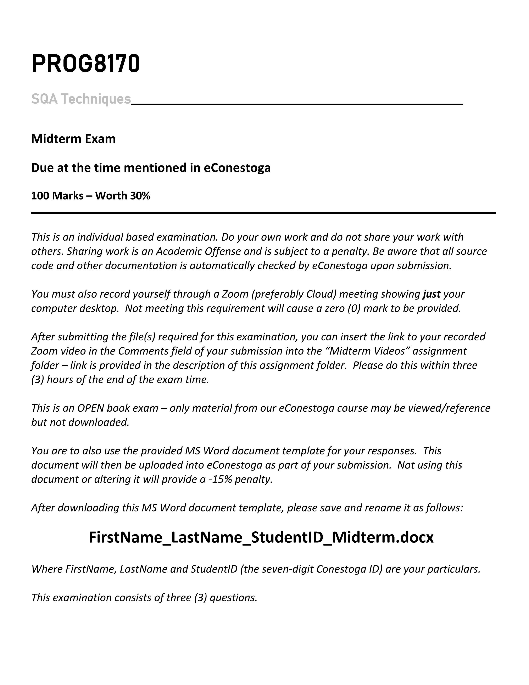
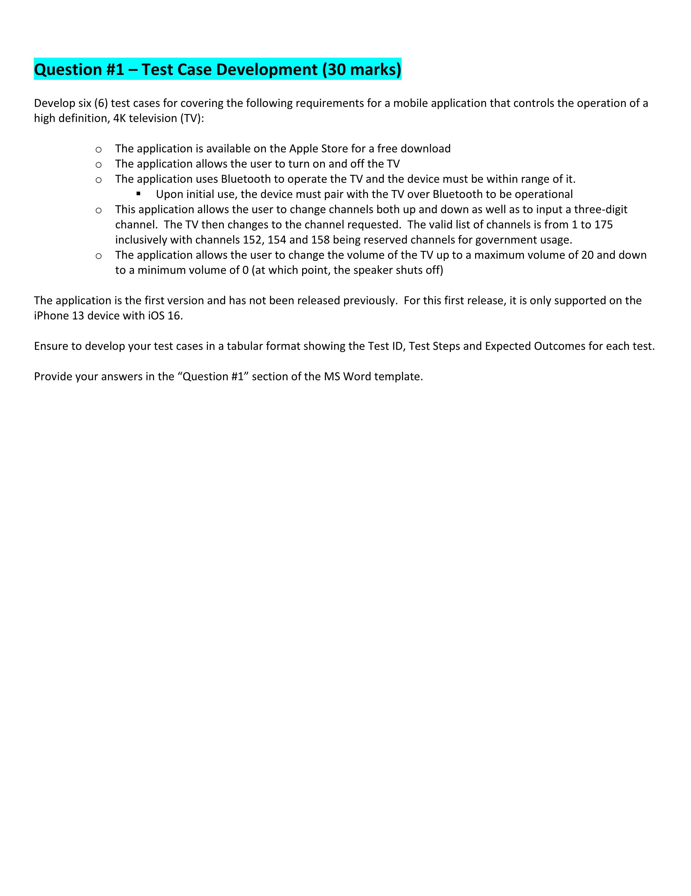
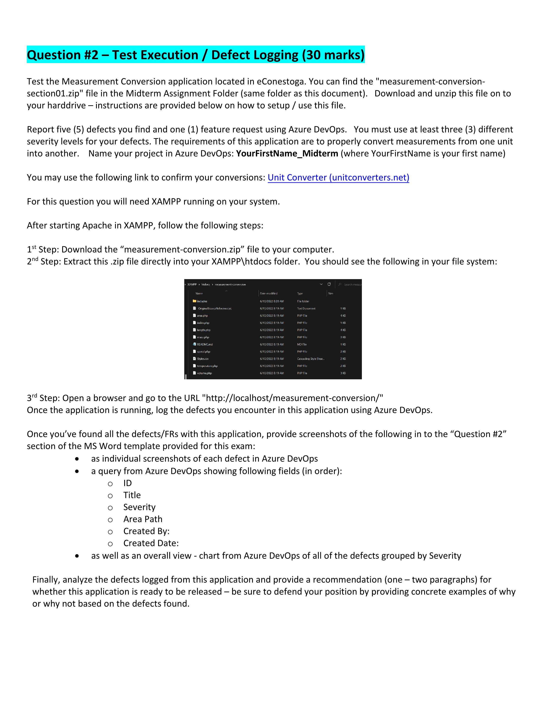
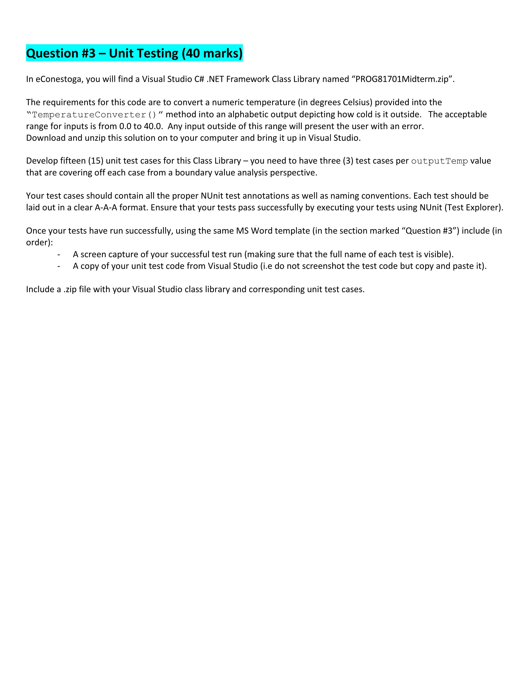
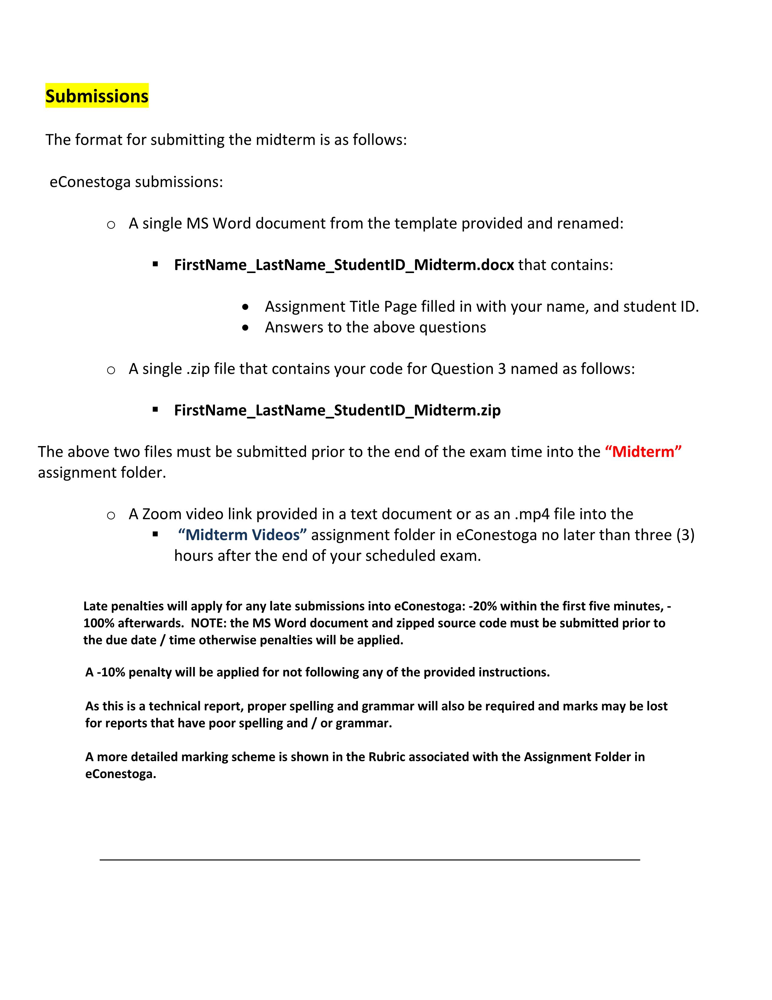

# PROG8170-23S-Sec1-Software-Quality-Assurance-Midterm-Exam

The midterm exam of Conestoga College PROG8170-23S-Sec1 consists of Three Parts: Test Case Development, Test Execution / Defect Logging and Unit Testing.

## Requirements

## Question 1 Table

[Q1.xlsx](./doc/Q1.xlsx)

## Question 2 Project Address

[https://dev.azure.com/Sliu9412/Siyu_Midterm/_workitems/recentlyupdated/](https://dev.azure.com/Sliu9412/Siyu_Midterm/_workitems/recentlyupdated/)

## Doc

[Siyu_Liu_8859412_Midterm.docx](./doc/Siyu_Liu_8859412_Midterm.docx)
